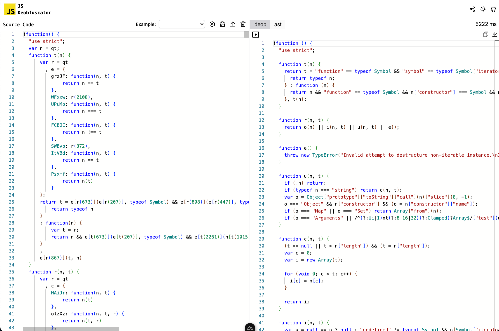

## JS混淆代码还原

让混淆不再成为逆向分析中的绊脚石

## 使用

### 网页

[js-deobfuscator.vercel.app](https://js-deobfuscator.vercel.app/) 在线体验



在执行还原前，请根据实际代码配置

### 本地

安装

```
git clone https://github.com/kuizuo/js-deobfuscator
cd js-deobfuscator
pnpm i
```

在 tmp/input.js 存放需要反混淆的代码, 执行 `pnpm run tmp` 将会输出 tmp/output.js 反混淆后的代码.

在 example 目录下存放了一些我个人遇到混淆代码实例分析以及配置选项，每个子目录的结构如:

```
├── xxx                           # 子目录
│   ├── index.ts                  # 运行代码
│   ├── input.js                  # 混淆代码
│   ├── output.js                 # 还原后代码
│   ├── pretty.js                 # 用作美化对比
│   ├── setupCode.js              # 注入执行代码
│   ├── errorCode.js              # 当替换代码导致语法错误, 则将错误代码输出到该文件
```

由于项目采用 ts 开发且使用 esmodule，因此建议使用 [tsx](https://github.com/privatenumber/tsx) 来执行 index.ts。

## 使用文档

混淆还原有几个关键代码

**字符串数组**：一个长度非常长的字符串数组，通常存放所有加密的字符串

**乱序函数**：通常是一个自调用函数，参数为字符串数组，目的是对字符串数组进行打乱操作

**解密器**：通过调用解密器(函数)，还原成原始文本。

本项目提供三种方式用于定位解密器：字符串数组长度，解密器调用次数，自行扣代码注入，根据实际混淆代码来进行定位。

## 致谢

- [反爬虫 AST 原理与还原混淆实战](https://book.douban.com/subject/35575838/)
- [j4k0xb/webcrack](https://github.com/j4k0xb/webcrack)
- [sxzz/ast-explorer](https://github.com/sxzz/ast-explorer)

